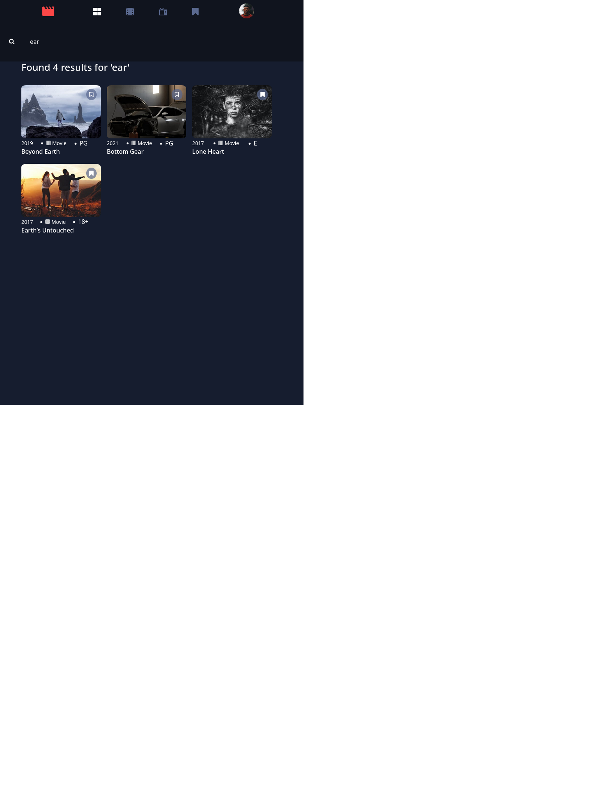

# Security Research Group - Entertainment Web App Solution

This is a solution for the entertainment web app project

Author: Jacob McAllister

## Table of contents

- [Security Research Group - Entertainment Web App Solution](#security-research-group---entertainment-web-app-solution)
  - [Table of contents](#table-of-contents)
  - [Overview](#overview)
    - [The challenge](#the-challenge)
    - [Screenshot](#screenshot)
  - [My process](#my-process)
    - [Built with](#built-with)
    - [What I learned](#what-i-learned)
    - [Continued development](#continued-development)
    - [Useful resources](#useful-resources)
  - [Noteworthy](#noteworthy)
    - [Bonus](#bonus)
    - [User Credentials for Testing](#credentials)
  - [Unimplemented](#unimplemented)
    - [Styles](#styles)

## Overview

### The challenge

Users should be able to:

- View the optimal layout for the app depending on their device's screen size
- See hover states for all interactive elements on the page
- Navigate between Home, Movies, TV Series, and Bookmarked Shows pages
- Add/Remove bookmarks from all movies and TV series
- Search for relevant shows on all pages
- Build this project as a full-stack application

### Screenshot

## My process
It has been a while since I've worked with ASP.NET as a server-side framework, so this is where my focus started since this is where I felt I had the most to learn. Over the past weekend, I created multiple example projects experimenting with various aspects of the framework as well as reading through a lot of documentation. Through this hands-on approach, I was able to re-familiarize myself with ASP.NET and its workflow. Once I was able to successfully connect and interact with a database and generate sessions for user logins (as well as getting more comfortable again in general), I think moved to working on the front end implementation in Angular. I started with thinking about how I could break down the design elements into various components, and break various functionalities into services - the aim being for a high degree of modularity and ability to re-use components.

I decided that I would implement that sending down of the data.json data and the building of the Home page first, before worrying about user logins and bookmarking functionality. Once the components for the Home page were created, much of that was able to be re-used on the other views. I also separated out the data.json into multiple JavaScript objects which are maintained throughout the operation of the application. The rationale behind this being, that separating data.json object into object that contained specifically movies or tv-series and so on, allows less time iterating over the original array of show objects. I used the array index for the original array of shows as the property for each more specific "list" (since the array indexes were unique), and therefore, if a specific show was needed, it could be accessed in an O(1) manner since the key is used as an identifier in the HTML. This also allowed for the application to not have to sort the overall list every time that a new route was accessed (get all the movies for the movie route; get all of the tv-series for the tv-series route, etc). Upon the updating of a bookmark, the data is sent back to the server and saved, so the bookmark list is persistent across user logins and application starting and stopping.

After I was happy with the components I'd made for each of the views showing the show data, I then implemented the search functionality and its relevant components. Once this was working properly, I then turned my attention towards implementing user creation and logging, and adding interceptors and auth-guards to Angular to guard routes from users who are not logged in from accessing them.

The very last thing that I did was implement the mobile-responsiveness of the site. Throughout development, I used the mobile-view as my working "screen size" for design. At the end, I added the necessary styles for tablet and desktop screen sizes.

### Built with

- Semantic HTML5 markup
- CSS custom properties
- Bootstrap
- Flexbox
- CSS Grid
- Mobile-first workflow
- Angular framework
- ASP.NET MVC Core
- SQLite
- Postman (for initial testing)

### What I learned

Before starting on this project, it'd been a while since I'd worked with ASP.NET MVC Core as a server-side framework. Over the last few years, I've used PHP Laravel, NodeJS, and Spring Boot, so over this past weekend, my primary focus was re-learning and re-familiarizing myself with ASP.NET and its structure again - as well as how this would interact with Angular. I took a lot of time studying and experimenting on how various things are registered within the framework, such as routes and controllers, and the specific decorators that the framework uses. When creating the database interaction for storing users, though I found ways to do this in ways that would work, I wanted to build the interaction the ".NET way" - and I did!

It took a lot of studying, but I'm very happy with how the server-side ended up turning out and how quickly I was able to pick up on the flow that ASP.NET uses. I would credit a lot of that to gaining experience working with with the other mentioned frameworks over the last few years since each one aims to accomplish essentially the same thing(s) and therefore this lends to a good amount of overlap among these technologies.

### Continued development

For me, the most exciting aspect to these projects is the programming aspect. I think that I am pretty good with CSS, but I know that I could do to get some more practice with this. For example, for the desktop view, I did not implement the navigation bar moving to the left side of the screen - instead the navigation bar stays at the top. I was having some issues modifying those styles and elements. I worked from the mobile version and then moved to the tablet version, and then the last task I did was the desktop styles. Since the deadline for this demo is here now, I made the navigation bar look good the way it was, even for desktop, but this would be something that I would adjust if I were to continue working on this project.

As mentioned before, I had to re-familiarize myself with ASP.NET since over the last year, I have used other server-side frameworks. I think that C# and .NET in general has a lot to offer and is popular framework, and is well worth getting to know better.

AngularJS is something that I've used over the last couple of years and have gotten a lot more comfortable with, and have really enjoyed. I find myself learning new things with this framework, as there is a lot to learn!

### Useful resources

- [Microsoft Documentation](https://docs.microsoft.com/en-us/dotnet/api/?view=net-6.0) - This was extremely usesful for reference on various aspects of ASP.NET and C#
- [Angular documentation](https://angular.io) - The Angular documentation was frequently used!
- [Web Developer's Site for ASP.NET](https://jasonwatmore.com/post/2022/01/07/net-6-user-registration-and-login-tutorial-with-example-api) - This was a great site that I found with working examples of user logins with ASP.NET. I was able to experiment with the repo that he has available, figure out how it worked, and modify and translate it for my uses.

## Noteworthy

### Bonus

User creation and login is working, and there is an auth-guard in Angular ensuring that all routes other than the /login and /signup routes are not accessible for users not logged in.

All data for the shows is retrieve on from the server by the client on first load of the application. Any changes to bookmarks is sent back to the server and saved. Therefore, bookmarks are persisted through user logins and application starting and stopping.

### User Credentials for Testing

username: bottle
password: abc

You also can create your own user as well!

## Unimplemented

### Styles

I ran out of time here at the end to get the navigation bar to be fixed on the side of the screen for the desktop layout. Right now it stays at the top for desktop like it is for the mobile and tablet screen sizes.

I did not do anything with font-styles. I also just used various "h" tags for the font-sizes as well, and some custom CSS. I was so focused on getting other functionality working, I completely missed the writing metioning the size of the typography in the initial design document. The login and signup page typography for the input boxes are also slightly different from the original design.